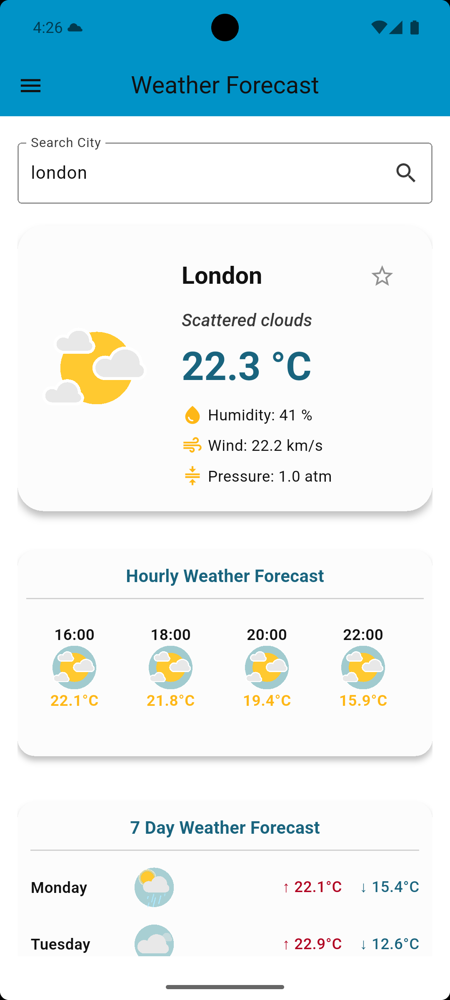
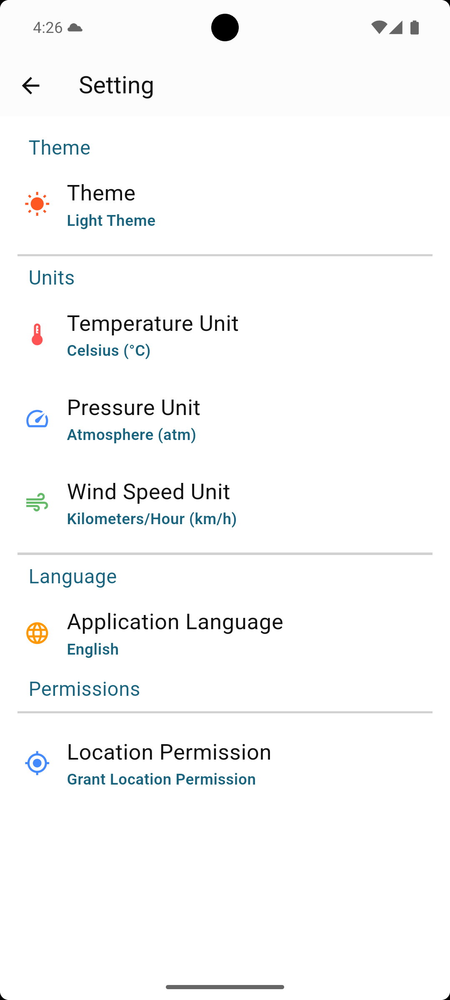
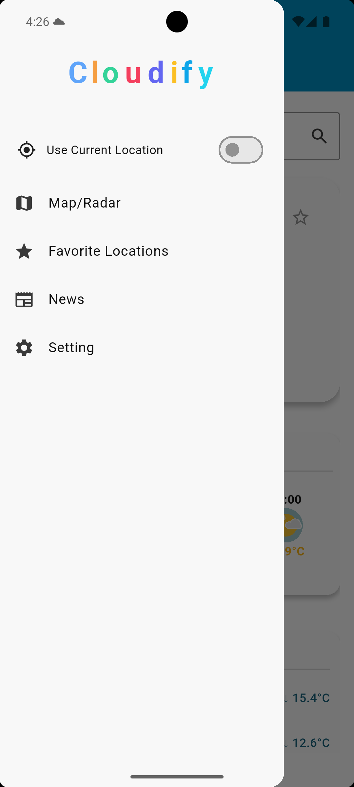

# 🌦️ Cloudify

A comprehensive, multi-language, and modernly designed Flutter weather application.

## Features

- 🔄 **Real-time weather** and hourly/daily forecasts
- 📍 **Weather by location** and city search
- ⭐ **Favorite cities** list
- 📰 **Weather news**
- 🌗 **Dark/Light theme** and theme selection
- 🌡️ **Unit switching:** Celsius, Fahrenheit, Kelvin, pressure, wind speed
- 🎏  **Multi-language support:** Turkish, English, (and 4 more languages)

## Used Packages

- [provider](https://pub.dev/packages/provider) — State management
- [intl](https://pub.dev/packages/intl) — Date, number, multi-language and currency formatting
- [flutter_dotenv](https://pub.dev/packages/flutter_dotenv) — Environment variable management (.env file support)
- [shared_preferences](https://pub.dev/packages/shared_preferences) — Persistent key/value storage on device
- [gap](https://pub.dev/packages/gap) — Easy spacing between widgets
- [lottie](https://pub.dev/packages/lottie) — Lottie animation support (JSON-based animated graphics)
- [flex_color_scheme](https://pub.dev/packages/flex_color_scheme) — Advanced theme and color scheme management
- [easy_localization](https://pub.dev/packages/easy_localization) — Multi-language support (online/offline)
- [flutter_local_notifications](https://pub.dev/packages/flutter_local_notifications) — Local notifications (Android/iOS)
- [flutter_svg](https://pub.dev/packages/flutter_svg) — SVG vector image support
- [geolocator](https://pub.dev/packages/geolocator) — Retrieve device location (GPS, network, etc.)
- [geocoding](https://pub.dev/packages/geocoding) — Address-to-coordinates and coordinates-to-address conversion
- [flutter_map](https://pub.dev/packages/flutter_map) — Map and location-based visualization
- [latlong2](https://pub.dev/packages/latlong2) — Geographical coordinate operations
- [permission_handler](https://pub.dev/packages/permission_handler) — App permissions management (location, notifications, etc.)

## Screenshots

<p float="left">
  
  
  
</p>

## Installation

1. Clone the repository:
```sh
   git clone https://github.com/Yido1007/weather_forecast
   cd weather_forecast
```
2.Install dependencies:
```sh
    flutter pub get
```
3.Add the required API keys to your .env file:
```sh
    WEATHER_API_KEY=https://openweathermap.org/
    NEWS_API_KEY=https://newsapi.org/
```
4.Run the application:
```sh
    flutter run
```
This project is licensed with the [MIT License] (LICENSE).
