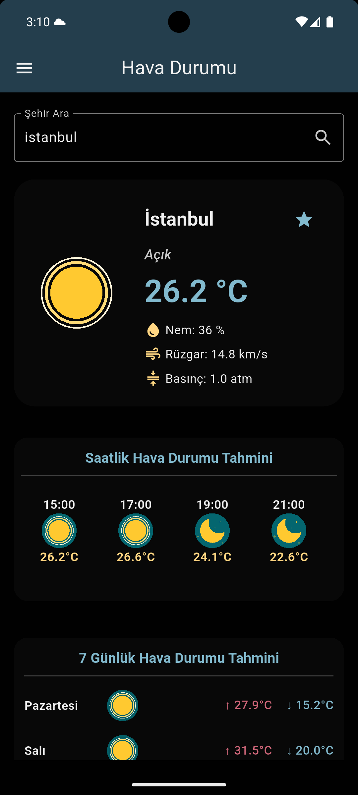
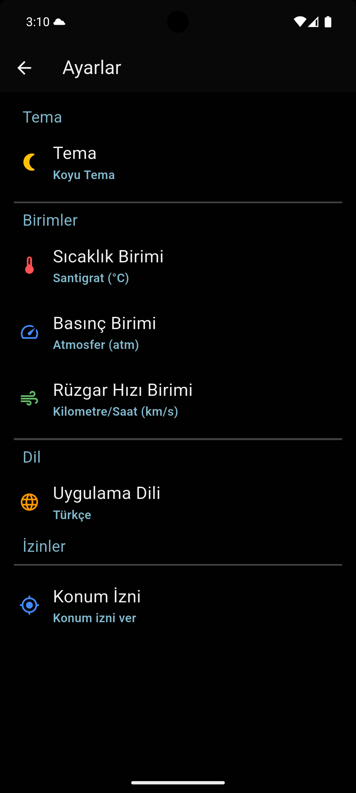
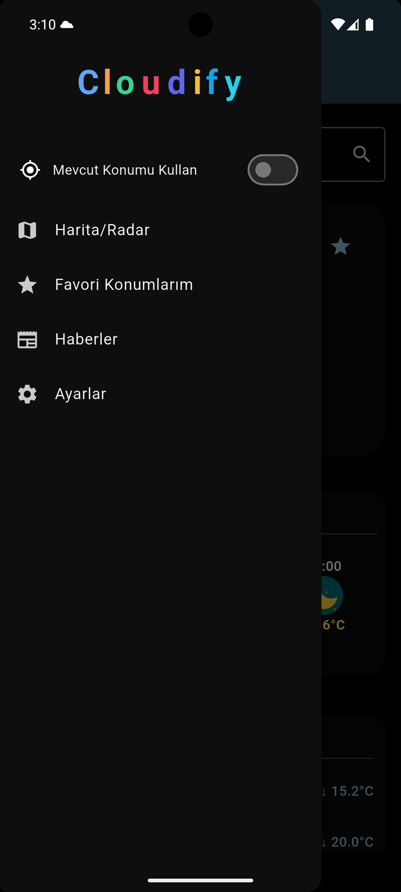

# 🌦️ Cloudify

Kapsamlı, çok dilli ve modern tasarımlı bir Flutter hava durumu uygulaması.

[English](README.en.md) | [Türkçe](README.md)

## Özellikler

- 🔄 **Gerçek zamanlı hava durumu** ve saatlik/günlük tahminler
- 📍 **Konumdan hava durumu** ve şehir arama
- ⭐ **Favori şehirler** listesi
- 📰 **Hava durumu haberleri**
- 🌗 **Koyu/Açık tema** ve tema seçimi
- 🌡️ **Birim değiştirme:** Santigrat, Fahrenheit, Kelvin, basınç, rüzgar hızı
- 🎏  **Çoklu dil desteği:** Türkçe, İngilizce, (ve eklediğin diğer diller)

 ## Kullanılan Paketler

- [provider](https://pub.dev/packages/provider) — Durum yönetimi (State Management)
- [intl](https://pub.dev/packages/intl) — Tarih, sayı, çoklu dil ve para birimi biçimlendirme
- [flutter_dotenv](https://pub.dev/packages/flutter_dotenv) — Ortam değişkenleri yönetimi (.env dosyası desteği)
- [shared_preferences](https://pub.dev/packages/shared_preferences) — Cihazda kalıcı anahtar/değer veri saklama
- [gap](https://pub.dev/packages/gap) — Widgetlar arasında kolay boşluk bırakma
- [lottie](https://pub.dev/packages/lottie) — Lottie animasyon desteği (JSON tabanlı hareketli grafikler)
- [flex_color_scheme](https://pub.dev/packages/flex_color_scheme) — Gelişmiş tema ve renk şeması yönetimi
- [easy_localization](https://pub.dev/packages/easy_localization) — Çoklu dil desteği (çevrim içi/dışı)
- [flutter_local_notifications](https://pub.dev/packages/flutter_local_notifications) — Yerel bildirimler (Android/iOS)
- [flutter_svg](https://pub.dev/packages/flutter_svg) — SVG vektör görsel desteği
- [geolocator](https://pub.dev/packages/geolocator) — Cihazın konumunu alma (GPS, ağ vs.)
- [geocoding](https://pub.dev/packages/geocoding) — Koordinattan adrese ve adresten koordinata çevirim
- [flutter_map](https://pub.dev/packages/flutter_map) — Harita ve konum tabanlı görselleştirme
- [latlong2](https://pub.dev/packages/latlong2) — Coğrafi koordinat işlemleri
- [permission_handler](https://pub.dev/packages/permission_handler) — Uygulama izinleri yönetimi (lokasyon, bildirim vs.)


## Ekran Görüntüleri

<p float="left">
  
  
  
</p>


## Kurulum

1. Depoyu klonlayın:
```sh
   git clone https://github.com/Yido1007/weather_forecast
   cd weather_forecast
```   
2.Bağımlılıkları yükleyin:
```sh
    flutter pub get
```
3.Gerekli API anahtarlarını .env dosyasına ekleyin
```sh
    WEATHER_API_KEY=https://openweathermap.org/
    NEWS_API_KEY=https://newsapi.org/
```
4.Uygulamayı başlatın
```sh
    flutter run
```
## Lisans

Bu proje [MIT Lisansı](LICENSE) ile lisanslanmıştır.
